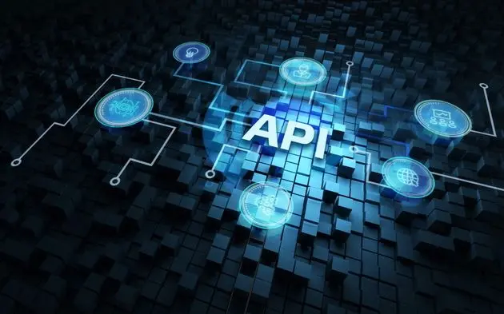

# I'm API

Développement et déploiement d'une API métier.

# Contexte du projet

👋 Hey les amis, vous connaissez la dernière nouvelle ? 🤔 Vraiment ? Eh bien j'ai été élu Maire avec 99,9% de voix des Alumnis et Simploniens (merci Cambridge Analytica 💰💰💰), eh ouais ma gueule.....euh enfin OUI mes chèrs concitoyens 🇫🇷🥖.

Et en tant que Maire de Simplonville, je souhaite développer des outils numériques accessibles par toutes & tous.

Priorité numéro 1, la sécurité de tous. Je souhaite faire développer une application pour alerter dans ma ville. Alors alerter de quoi ? Accident, travaux, problème de voirie (propreté, éclairage,...), chien perdu, etc... et comment ? via une application mobile et une gestion administrateur via un Dashboard en version Web & Desktop. Mon équipe IT étant débordé, je compte sur votre talent pour mettre en place ce projet (**Uniquement l'API**). L'étude a été réalisé en amont et le choix des technos également.

L'équipe qui reprendra le projet pour les futures amélioration est formée sous **Node.js & MongoDB**. Vous l'aurez deviné, le projet doit se faire via cette technologie.

Comment va fonctionner cette application ? C'est ultra simple. Un simple formulaire de signalement avec :

  - un champ pour choisir le type d'alerte (voirie, stationnement, travaux,etc)
  - un champ de type textarea pour décrire l'alerte
  - un champ date
  - un champ horaires
  - un champ pour l'adresse sous forme de carte intéractive avec possibilité de géolocalisation
  - un champ photo (caméra smartphone)
  - les champs classiques :
    - nom,
    - prenom,
    - adresse,
    - cp,
    - ville,
    - email,
    - téléphone

BONUS : possibilité d'envoyer une vidéo de 30 secondes max

**Chaque alerte sera envoyée à différentes adresses email selon le sujet d'alerte.**

  - Pour la voirie, envoyer à voirie@simplonville.co
  - Pour les animaux, envoyer à animaux@simplonville.co

Etc....

**L'API doit être documentée & déployer !**

# Modalités pédagogiques

Mise en place d'une organisation en mode agile avec un kanban, etc...

Deadline : tic tac tic tac...** 22 Décembre 9h14**

# Livrables

Un dépôt GitHub, Une API en ligne, une démo depuis un client REST (postman, insomania, .....)
