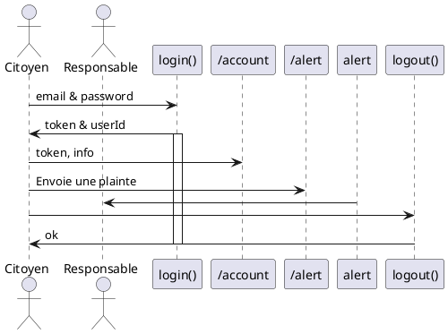
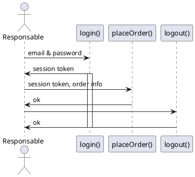

# I'am API, modélisation

## User Story : Citoyen

1. Il peut créer un compte
2. Il peut se connecter
3. Il peut voir son compte
4. Il peut le supprimer
5. Il peut envoyer une alert
   1. ...avec une image
   2. ...avec une video
6. Il peut voir la liste de ses alertes
7. Il peut supprimer ses alertes

Alert :
  - alersId
  - userId
  - Type d'alerte : voirie, stationnement, travaux
  - Description : textarea pour décrire l'alerte
  - Date : createdAt & updatedAt
  - Horaires
  - Adresse de l'alert
  - Coordonnées GPS
  - Photo (caméra smartphone)

User :
  - userId,
  - nom,
  - prenom,
  - adresse,
  - cp,
  - ville,
  - email,
  - téléphone

### Diagramme de séquence

## User Story : Responsable

1. Il peut faire la meme chose que le citoyen
2. Il peut voir la liste des alertes selon son service
3. Il peut mettre à jour le status des alerts

### Diagramme de séquence

## User Story : Admin

1. Il peut faire la meme chose que le responsable
2. Il peut donner un role au responsable
3. Il peut attribuer le service au responsable
