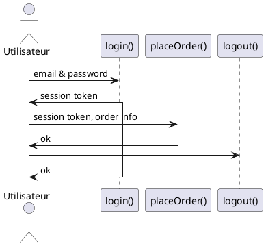
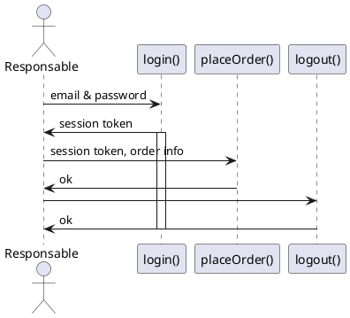

# I'am API, modélisation

## User Story Utilisateur

Hal veut signaler un probleme qu'il voit depuis sa fenetre depuis son pc
  - un champ pour choisir le type d'alerte (voirie, stationnement, travaux,etc)
  - un champ de type textarea pour décrire l'alerte
  - un champ date
  - un champ horaires
  - un champ pour l'adresse sous forme de carte intéractive avec possibilité de géolocalisation
  - un champ photo (caméra smartphone)
  - les champs classiques :
    - nom,
    - prenom,
    - adresse,
    - cp,
    - ville,
    - email,
    - téléphone

### Diagramme de séquence

## User Story Responsable

Le responsable se connecte à l'application et peut voir la liste de tous les alertes adrésser à son service. Il a la possibilité de renseigner son mail pour recevoir les alertes directement.

### Diagramme de séquence

