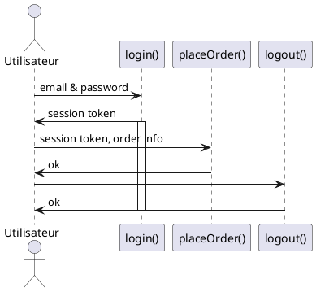
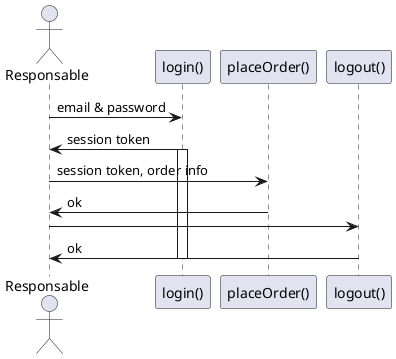

# I'am API, modélisation

## User Story : Utilisateur

Hal veut signaler un probleme qu'il voit depuis sa fenetre depuis son pc

Alert :
  - alersId
  - userId
  - Type d'alerte : voirie, stationnement, travaux
  - Description : textarea pour décrire l'alerte
  - Date : createdAt & updatedAt
  - Horaires
  - Adresse de l'alert
  - Coordonnées GPS
  - Photo (caméra smartphone)

User :
  - userId,
  - nom,
  - prenom,
  - adresse,
  - cp,
  - ville,
  - email,
  - téléphone

### Diagramme de séquence

## User Story : Responsable

Le responsable se connecte à l'application et peut voir la liste de tous les alertes adrésser à son service. Il a la possibilité de renseigner son mail pour recevoir les alertes directement.

### Diagramme de séquence

